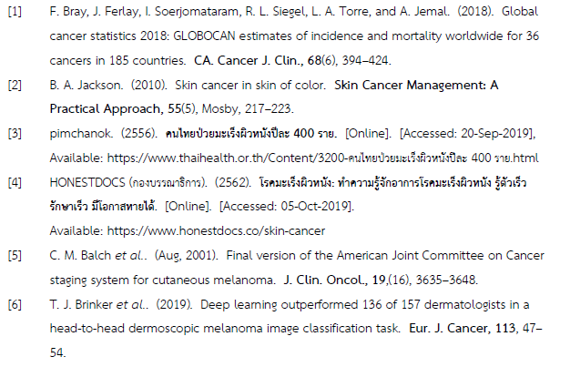

# Khon Kaen University - Computer Science Citation Style Language

## Purposes

Khon Kaen University has different style of citing reference, and many had struggled of editing in-line reference and bibliography.

## Installation

- Mendeley
  
  ```
  View -> Citation Style -> More Styles...

  On Get More Styles tab enter the URL 

  https://csl.mendeley.com/styles/563370651/kkucs

  to download
  ```
- Zotero
  ```
  ...
  ```

## Citation & Bibliography Examples

  

## Disclaimer
  
  This Citation Style mainly based on APA citation style.